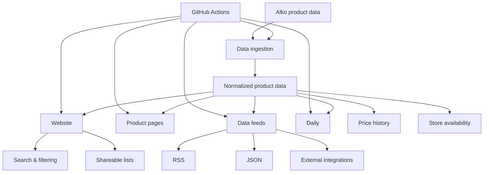
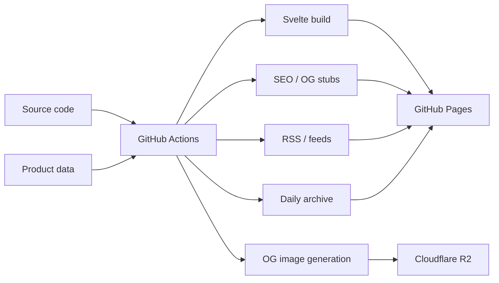

# Alkometriikka

**Alkometriikka is an independently maintained, continuously updated database and web application built around the Finnish Alko product catalog.**

_Alkometriikka on itsenäisesti ylläpidetty ja jatkuvasti päivittyvä tietokanta ja verkkosovellus, joka kokoaa yhteen tietoa Alkon tuotteista, hinnoista, saatavuudesta ja tuotehistoriasta._

[alkometriikka.fi](https://alkometriikka.fi/)

Alkometriikka started as a simple way to compare the price and amount of alcohol in different products. It has since grown into a broader data platform containing product information, price history, statistics, store availability, machine-readable feeds, automatically generated product pages, and interactive features.

## Features

* **Product database** — Browse and search the Alko catalog.
* **Advanced filtering** — Find products by category, price, alcohol content, size, producer, and other properties.
* **Product statistics** — Compare prices, alcohol content, value, and other calculated metrics.
* **Price history** — Track how product prices have changed over time.
* **Store availability** — See which Alko stores currently carry a product.
* **Shareable lists** — Create and share product selections.
* **Alkometriikka Daily** — A daily game generated from the product database.
* **Product pages** — Individual, search-engine-friendly pages for products in the catalog.
* **RSS feeds** — Follow catalog and product changes without visiting the site.
* **Machine-readable data** — The underlying datasets are published for use by the website and other applications.
* **Automated updates** — Product data and derived content are continuously processed through GitHub Actions.

## Architecture

The product dataset is the foundation of Alkometriikka. Automated data processing produces the data consumed by the website, generated product pages, feeds, and interactive features.



### Deployment

The production site is primarily served as a static site. GitHub Actions builds the application and generated content and publishes the resulting site to GitHub Pages. Open Graph images are generated separately and stored in a Cloudflare R2 bucket.



## Tech stack

* [Svelte](https://svelte.dev/)
* [SvelteKit](https://kit.svelte.dev/)
* [TypeScript](https://www.typescriptlang.org/)
* [Bun](https://bun.sh/)
* [Vite](https://vite.dev/)
* GitHub Actions
* GitHub Pages
* Cloudflare

## Development

Install dependencies:

```sh
bun install
```

Start the development server:

```sh
bun run dev
```

For development without running the data synchronization step:

```sh
bun run dev:no-sync
```

Build the application:

```sh
bun run build
```

Run type checking and Svelte diagnostics:

```sh
bun run check
```

Format the code:

```sh
bun run format
```

Check formatting:

```sh
bun run lint
```

## Data and generated content

The repository contains scripts for maintaining the product dataset and generating derived content.

### Data

```sh
bun run sync
bun run migrate
```

`sync` handles the product data pipeline, while `migrate` is used for data migrations between schema versions.

### Site generation

```sh
bun run sitemap
bun run og:images
```

These generate supporting content for the production site, including the sitemap and Open Graph images.

### Daily

```sh
bun run daily
bun run backup:daily
```

The Daily game is generated from the product dataset. Historical games are preserved so that previously published Daily questions remain immutable.

## Using Alkometriikka data

Alkometriikka's machine-readable data is provided so that others may build useful projects and integrations around it.

Please **do not hammer the site or its data endpoints with requests**.

If you are building an application that consumes Alkometriikka data:

* Cache responses locally whenever possible.
* Do not repeatedly request the same data when it has not changed.
* Prefer the published feeds and machine-readable datasets over scraping individual pages.
* Avoid aggressive polling and unnecessary concurrent requests.
* Use a sensible refresh interval appropriate for your application.
* Respect HTTP caching headers where provided.
* If you need a large amount of data, download it once and process it locally rather than repeatedly requesting individual resources.
* Do not build systems that continuously crawl the entire site or product catalog.

Alkometriikka is an independently maintained project with limited infrastructure. **Reasonable use helps keep the service available for everyone.**

If your application has an unusual or particularly heavy data requirement, consider getting in touch before deploying it.

## Feeds and integrations

Alkometriikka provides machine-readable interfaces intended to make the data useful outside the main website.

These can be used for applications such as:

* RSS readers
* Discord bots
* Automated notifications
* Data analysis
* Personal projects
* Other integrations built around Alkometriikka's data

The feed infrastructure also allows changes detected by the automated data pipeline to be consumed by external applications without requiring them to continuously poll the website.

When building an integration, **please use the feeds and published datasets where possible, cache the data, and avoid unnecessary requests**.

## Static generation

The product routes are pre-generated primarily to provide search engines and link previews with useful metadata.

The generated product HTML is intentionally lightweight and acts largely as a stub containing SEO metadata, structured data, Open Graph information, and the basic page shell. The actual application functionality and product data are handled by the client-side application and published data files.

This approach provides:

* Search-engine-friendly product URLs
* Useful Open Graph previews when links are shared
* Structured data for search engines
* Fast initial page responses
* A static deployment without requiring a traditional application server

The generated files should therefore not be considered a separate product database or a complete server-rendered version of the application. They are primarily an SEO and metadata layer around the underlying Alkometriikka application and data.

## Privacy

Alkometriikka uses privacy-focused analytics to understand how the site is used.

No account is required to use the site, and the application does not require personal information for its core functionality.

## Disclaimer

Alkometriikka is an independent project and is **not affiliated with Alko**.

Product information, prices, availability, and other data may change and may not always reflect the current situation at an individual Alko store. Store availability in particular may be delayed depending on the project's data collection schedule.

Alkometriikka does not sell alcohol or facilitate alcohol purchases.

Alcohol consumption carries health risks. Please drink responsibly.

## Huomautus

Alkometriikka on itsenäinen projekti, eikä se ole Alkon ylläpitämä tai Alkon kanssa millään tavalla yhteistyössä toteutettu palvelu.

Tuotetiedot, hinnat, saatavuustiedot ja muut tiedot voivat muuttua, eivätkä ne välttämättä aina vastaa Alkon ajantasaista tilannetta tai yksittäisen myymälän todellista saatavuutta. Erityisesti myymälöiden saatavuustiedot voivat olla viivästyneitä tietojen keräysaikataulun vuoksi.

Alkometriikka ei myy alkoholia eikä suoraan mahdollista alkoholin ostamista.

Alkoholin käyttöön liittyy terveysriskejä. Käytä alkoholia vastuullisesti.
